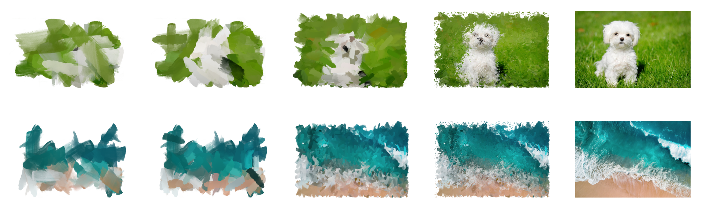

# Genetic Brushes 
Genetic brushes is an image painter that mimics the process of painting of an image into 
a canvas. 

# Implementation 
This artificial intelligence project is powered on genetic algorithms where each brush in the painting 
represents an individual of a population, this brushes mutate and improve with time, thus creating 
more realistic paintings overall. To improve the perfomance of the algorithm we provide additional 
information to the brushes such as the color of the original image are their position, and the importance 
of that position. The importance of a position of the image is calculated on a convoluted filter of 
vertical and horizontal edges. The genetic algorithm applies three kind of operators; mutation, selection,
and crossover. Mutation works by randomizin a specific feature of the current generation of brushes. 
After the mutation a crossover between different pairs of individuals. Finally we select the brushes 
based on their importance as explained before.  

The following image sequence is just a peek at what the algorithm is capable of generating. A total of 
2000 frames where generated to achieve a realistic painting look in this example, the sample images are 
some samples of all the frames that demostrate the continuity of the painting. To get this results a lot 
of frames where used, but when tuning the hyperparameters we can get results with much fewer frames. In 
other words, the speed can be selected. The first four images were generated by the algorithm and the last 
one is the input image.   

 

# Requirements 

    opencv-python~=4.2.0.34
    numpy~=1.18.5
    
